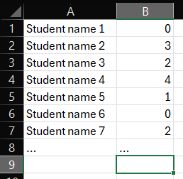

# Lab-Gen-Macro
Excel macro for creating a lab attendance workbook

## Setup 

1. Clone the repo or download from GitHub  
```
git clone https://github.com/skmhaupt/Lab-Gen-Macro.git
```
2. Move or copy the .xlam file to C:\Users\\<user>\AppData\Roaming\Microsoft\AddIns
3. Right click the .xlam file, ...
4. Open a new or existing workbook
5. Go to the developer tab (enable if not visible)
6. Click on Excel Add-ins under Add-ins, and enable Lab_Gen_Macro_v1.2  

<p align="center">

</p>

7. Open "Customise Quick Access Toolbar", under "Choose commands from" select "Macros", then add "Make_Labs_Workbook" to the Toolbar and select "OK".  

<p align="center">

</p>

8. The macro should be available with the button that was added to the Quick Access Toolbar.  

<p align="center">

</p>

## Usage

### Starting data

The input data has to be ready in a workbook before starting the macro. The expected input data format is a excel workbook with student lab group choices from Merlin. If using data from Merlin nothing has to be prepared before starting the macro as it can be launched directly from the workbook that was downloaded from Merlin.  
The second acceptable data format is available for cases when Marlin data is not available. The input data has to be in the first two columns of the workbook where all student names are in column 1 and the according group selections in column 2 (both start in row 1 so no labels are allowed). If a student isn't part of any group use "0" for group choice.  

<p align="center">
  
  
</p>

### Executing macro

Starting the macro is simply done by clicking on the shortcut button that was added in the Quick Access Toolbar (Step 7/8 in Setup).  
Upon starting, a small window will appear asking the user for input informations.  
The user is asked to input:
- Subject name - required field
- Number of lab exercises ("lab0" not included) - required field
- whether the first lab is evaluated and if it needs a "lab0" label (by default "lab0" is not used)

Additionally, under the options tab, the user can change the language and setup custom labels for lab exercises.  
When using custom labels the "lab0" label setting is unavailable.

<p align="center">
  
</p>

### Output

Three sheets are generated using this macro:  

<p align="center">
  
</p>

1. The first and main sheet has all students in one table and the schedule in a second table. The table with all the students can not be edited (protected) except for the last two columns. The schedule table is editable. The protection can be lifted without the need of a password.  
The last column is used to mark whether a student has already completed all lab exercises last year and doesn't have to repeat them. (Leave empty if student has to complete lab exercises and fill with any char if not)  
Lastly the main sheet has the button "Get Failed Students" that is used to get all students that failed.  
  
2. The second sheet has tables for every group that are to be used for inputting points that the students achieved for every exercise. Points have to be in range from "1-10" where "5" and above is passing. If the first lab is not evaluated then its points are used for attendance with "0" meaning "absent" and "1" meaning "present".  
The "G0" table is filled with all students that didn't choose a group.  
  
3. The last sheet has a concise overview on all groups.  


### Editing existing workbooks

<p align="center">
  
</p>

The macro can be used to make changes on an already setup workbook if needed (like adding a new student or changing group data). Old data will be parsed out of the workbook in order to fill out the User-Form for ease of use. Backups are made as well for group tables to preserve all old grades, but copy-pasting data from backups will have to be done manually.  
As was already mentioned the student table on the main sheet is not editable but the protection can be lifted without a password. The last two columns are editable and new students can be added under the table (row after the table ends) without having to lift the protection.
